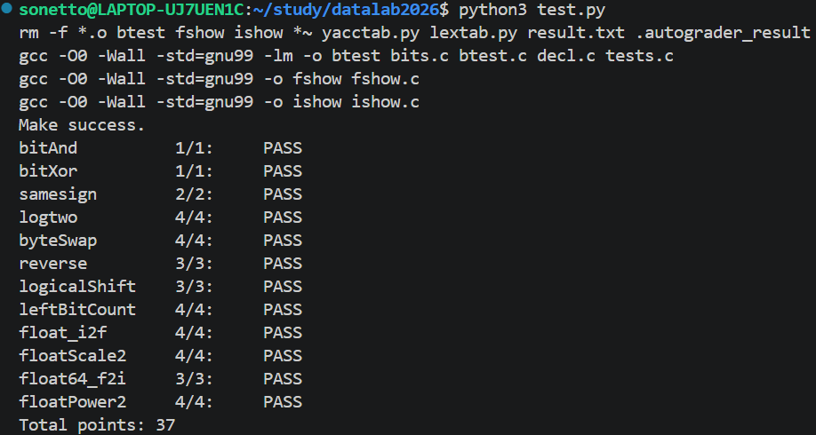

# datalab 报告

姓名：董佳鑫

学号：2025201713

| 总分 | bitAnd | bitXor | samesign | logtwo | byteSwap | reverse | logicalShift | leftBitCount | float_i2f | floatScale2 | float64_f2i | floatPower2 |
| --------- | -------- | -------- | --------- | ------ | -------- | ------- | ------------- | ------------- | --------- | ----------- | ----------- | ----------- |
| 37.00     | 1.00     | 1.00     | 2.00      | 4.00   | 4.00     | 3.00    | 3.00          | 4.00          | 4.00      | 4.00        | 3.00        | 4.00        |

test 截图：



## 解题报告

### 亮点

按我自己认为的实现质量排序：

1. **byteSwap**：11 ops（上限 17）。用“两个字节之差”一次性构造出双向掩码，无分支、不需要分别拼装两个字节。
2. **logicalShift**：9 ops（上限 20）。纯 `int` 运算，既没有写 `1 << 31`，也没有依赖隐式的无符号转换。
3. **leftBitCount**：39 ops（上限 50）。一个统一的二分框架（块长 16/8/4/2/2）覆盖全部 32 位，包括 `-1` 的 32。
4. **float_i2f**：29 ops（上限 30）。在预算内实现了就近取偶舍入，并且为了确认边界，我用穷举程序复核了全部 2^32 个输入。

### 总体思路

所有题目都是同一件事：**把“分支/循环”换成算术与位运算，把“比较”换成一次移位或掩码**。

一句话版：

| 函数 | ops/上限 | 核心想法 |
| ------- | ---- | ---------------------------------------------- |
| bitAnd | 4/7 | 德摩根：`x & y == ~(~x \| ~y)` |
| bitXor | 7/7 | `x ^ y == (x\|y) & ~(x&y)`，而 `x\|y == ~(~x & ~y)` |
| samesign | 3/12 | `x>>31` 取符号位，`^` 判异号；剩下用 `if` 区分“同为负 / 同为正 / 同为 0 / 含 0” |
| logtwo | 18/25 | 二分：`s=(v>0xFFFF)<<4` 直接生成移位量，`v>>=s; r\|=s`，最后 `r\|=(v>1)` |
| byteSwap | 11/17 | 见下 |
| reverse | 5/30 | `while(i)` 循环 32 次：`r=(r<<1)\|(v&1); v>>=1` |
| logicalShift | 9/20 | 见下 |
| leftBitCount | 39/50 | 见下 |
| float_i2f | 29/30 | 见下 |
| floatScale2 | 19/30 | 按 `exp==0xFF / exp==0 / 其他` 三类讨论，尾数左移即乘 2 |
| float64_f2i | 15/60 | 与 IEEE754 语义一一对应：`exp<1023` 下溢 0，`exp>1054` 溢出，否则截断 |
| floatPower2 | 9/30 | 指数区间分段，非规格化用 `1<<(x+149)` |

### byteSwap

```c
nbyte = (x >> (n << 3)) & 0xFF;
mbyte = (x >> (m << 3)) & 0xFF;
diff  = nbyte ^ mbyte;
return x ^ ((diff << (n << 3)) | (diff << (m << 3)));
```

两个字节交换后，**发生变化的位恰好是这两个字节本身的差值在异或意义下的结果**。所以不必分别取出两个字节再拼回去，只需算出 `diff`，把它同时放到两个字节的位置上，与原数异或即可。全程没有分支，也没有用到 `-`（不能直接用 `x - nbyte + mbyte` 这种写法）。

细节：`n == m` 时 `diff == 0`，结果就是 `x`，自然正确；`diff << 24` 有可能会顶到 bit31，这在二补码机器上是确定的位运算结果（若按最严格的 C99 措辞要求完全规避，可以写成 `(diff | 0u) << ...`，仍是 15 ops、仍在上限内，我用的是纯 `int` 版本）。

### logicalShift

算术右移会把高 n 位补成符号位，因此需要一个“低 32-n 位为 1”的掩码把它清掉：

```c
low   = 0x7FFFFFFF >> ((n + 31) & 31);   /* n>=1 时即 0x7FFFFFFF >> (n-1) */
fixup = (low + ~0) >> 31;                /* 仅在 n==0 时等于 -1 */
return (x >> n) & (low | fixup);
```

关键是 `n == 0` 这个边界：此时需要保留全部 32 位，而 `low` 恰好为 0。注意到 `n == 0` 时 `low - 1 == -1`，算术右移 31 位就得到全 1 掩码；而 `n >= 1` 时 `low >= 1`，`(low-1)>>31` 为 0。这样既避开了 `1 << 31` 的溢出，也没有借助 `0xFFFFFFFF >> n` 这类依赖无符号类型的写法，全部是正数右移和 `int` 运算。

### leftBitCount

思路是把“连续 1 的个数”做成二分查找：`cnt` 表示已经确认的前导 1 个数，接下来要检查的块长度为 `c`，它在 32 位中的偏移是 `32 - cnt - c`，即 `~cnt + (33 - c)`（用 `~` 代替减法，因为本题不许用 `-`）。

- 块长依次取 16、8、4、2，最后收尾 2 位；
- 每块取 `w = x >> offset`，低 c 位保持原样（算术右移不影响低位），于是“整块都是 1”等价于 `!((w + 1) & mask)`：低 c 位全 1 时加一正好把它们进位掉；
- 最后 2 位用 `(w >> 1) + (w & (w >> 1))` 数出该窗口里的前导 1 个数：窗口含第一个 0 时它自然为 0，窗口是 `11` 时为 2，而 `-1` 的 32 也正好由这一步得到。

### float_i2f

1. 取符号与绝对值：`sign = ux & 0x80000000`，负数时 `mag = -ux`（对 `unsigned` 取负，`TMin` 也能得到正确的 `0x80000000`，不会像 `-x` 那样溢出）。
2. 求 `e = floor(log2(mag))`：`while (t >>= 1) e++;`，`e` 从 0 起，`|x| == 1` 不需要特判。
3. `e <= 23`：尾数没有精度损失，直接 `frac = mag << (23 - e)`。
4. `e > 23`：需要**就近舍入、.5 取偶**。令 `shift = e - 23`，`rem = mag & ((1<<shift)-1)` 是被丢掉的位，`half = 1 << (shift-1)` 是半个 ulp：
   - `rem > half` 直接进位；
   - `rem == half` 时只有尾数为奇数（`frac & 1`）才进位，保证结果最低位为 0；
   - 进位可能让尾数从 `0xFFFFFF` 变成 `0x1000000`，此时 `frac >> 24` 非零，右移一位并把 `e` 加一。

### floatScale2

按指数域分三类即可覆盖全部情况：

- `exp == 0xFF`：Inf/NaN 都原样返回（`2*Inf == Inf`，NaN 按题目要求返回参数）；
- `exp == 0`：0 或非规格化数，左移尾数即乘 2；若 `frac >> 22` 非零说明它升为规格化数，指数域补 1、隐式 1 丢掉；
- 其他：`exp + 1`；若变成 `0xFF` 说明溢出，返回 ±Inf。

### float64_f2i 与 floatPower2

- `float64_f2i`：先把 64 位拆成 `sign / exp / 尾数`。`exp < 1023` 表示 `|v| < 1`，截断为 0；`exp > 1054` 表示 `|v| >= 2^31`（含 Inf/NaN），返回 `0x80000000`；中间区间把尾数拼成 32 位后右移 `1054 - exp` 完成向零截断，再按符号检查是否越过 `int` 范围（负数用无符号取负，`-2^31` 也能正确得到 `0x80000000`）。
- `floatPower2`：规格化数的指数域是 `x + 127`，有效范围 `x ∈ [-126, 127]`；`x > 127` 返回 `+INF`；`x < -126` 时若 `x < -149` 已经低于最小非规格化数 `2^-149` 就返回 0，否则 `1 << (x + 149)`；移位量都在 `[0, 22]` 内，不会越界。

### 验证方式

- 用 `./btest` 调试正确性，`python3 test.py -V` 检查正确性 + 合规性（运算符种类、ops 数量、类型、类型转换），最终 `Total points: 37`，`make` 无任何警告；
- 为了不被 `btest` 的采样漏掉，我另外写了独立程序（放在 `/tmp`，没有进仓库）跟 `tests.c` 的参考实现逐一比对：`float_i2f`、`floatScale2`、`leftBitCount` 穷举了全部 2^32 个输入，`logtwo` 穷举了全部正数，`logicalShift` 对 `n = 0,1,16,24,31` 穷举了全部 `x`，`byteSwap` 对 `(n,m) = (0,3),(1,2),(0,0),(3,3)` 穷举了全部 `x`，其余函数做了上千万组随机与边界值测试，均无一处不一致。

## 反馈/收获/感悟/总结

本实验最大的体会是：**限制反而是理解位运算的最好工具**。一开始写 `logicalShift` 时很自然地想写 `1 << 31`，被禁止以后才真正想清楚“掩码必须从正数右移得到”，并顺手注意到 `n == 0` 这个特例；写 `byteSwap` 时也是因为不能用减法，才想到用 `diff` 一次性异或两个位置。另一个收获是舍入：`float_i2f` 的 `.5 取偶` 如果不按“最低位为 0”来实现，会在很多中间值上错一位，这种错误 `btest` 报出来的例子非常有帮助。

## 参考的重要资料

- 课程课件中关于补码、算术/逻辑右移、IEEE 754 单精度与双精度格式、就近取偶舍入的部分；
- `bits.c` 中每道题的注释，以及仓库自带的 `tests.c`（参考实现语义）、`btest`、`test.py`（合规性判定规则）。
